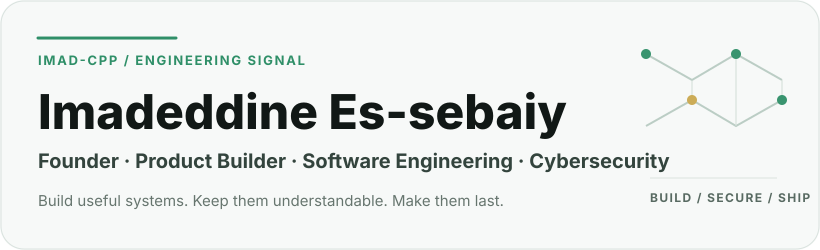
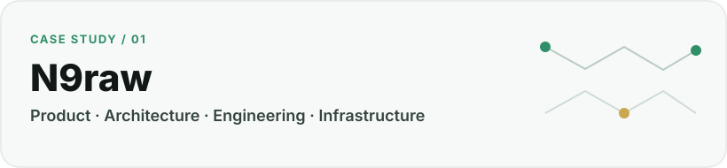
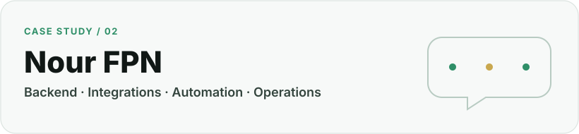
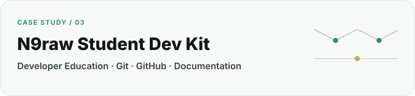
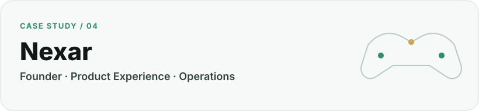

  <picture>
    <source media="(prefers-color-scheme: dark) and (max-width: 600px)" srcset="./assets/hero/hero-mobile-dark.svg">
    <source media="(prefers-color-scheme: light) and (max-width: 600px)" srcset="./assets/hero/hero-mobile-light.svg">
    <source media="(prefers-color-scheme: dark)" srcset="./assets/hero/hero-desktop-dark.svg">
    <source media="(prefers-color-scheme: light)" srcset="./assets/hero/hero-desktop-light.svg">
    
  </picture>

  <a href="https://es-sebaiy.com">Website</a> ·
  <a href="https://www.linkedin.com/in/imadeddine-es-sebaiy">LinkedIn</a> ·
  <a href="https://n9raw.com">N9raw</a> ·
  <a href="https://github.com/Imad-cpp?tab=repositories">Repositories</a>

  <a href="./profile/about.md">About</a> ·
  <a href="./profile/work.md">Work</a> ·
  <a href="./profile/education.md">Education</a> ·
  <a href="./profile/certifications.md">Certifications</a> ·
  <a href="./profile/github-engineering.md">GitHub Engineering</a>

## What I build

I am a Moroccan founder and software builder working across **product engineering, backend systems, cybersecurity and infrastructure**.

I like taking a real problem from idea to system: understanding the user, structuring the product, choosing clear architecture, building the software, connecting services, operating it reliably and documenting the decisions that matter.

[Read the full profile →](./profile/about.md)

## Currently building — N9raw

  <picture>
    <source media="(prefers-color-scheme: dark)" srcset="./assets/projects/case-n9raw-dark.svg">
    <source media="(prefers-color-scheme: light)" srcset="./assets/projects/case-n9raw-light.svg">
    
  </picture>

### N9raw — Moroccan Student Operating System

N9raw is the main product I am building to help Moroccan students **study, make informed education choices, find trustworthy resources, discover opportunities and move toward their first career**.

**Role:** Founder · Product · Engineering · Infrastructure

**Approved architecture:** `Next.js` · `React` · `TypeScript` · `Laravel` · `PostgreSQL` · `Redis` · `Meilisearch` · `Cloudflare`

[Explore N9raw](https://n9raw.com) · [Read the case study →](./profile/case-studies/n9raw.md)

## Selected systems

  <picture>
    <source media="(prefers-color-scheme: dark)" srcset="./assets/projects/case-nour-dark.svg">
    <source media="(prefers-color-scheme: light)" srcset="./assets/projects/case-nour-light.svg">
    
  </picture>

### Nour FPN

A WhatsApp-first student assistant for FPN Nador, built with Laravel, queued message processing, academic-service integrations and controlled administration.

**Focus:** Backend · WhatsApp Cloud API · Automation · Integrations · Linux Operations

[Read the Nour FPN case study →](./profile/case-studies/nour-fpn.md)

  <picture>
    <source media="(prefers-color-scheme: dark)" srcset="./assets/projects/case-devkit-dark.svg">
    <source media="(prefers-color-scheme: light)" srcset="./assets/projects/case-devkit-light.svg">
    
  </picture>

### N9raw Student Dev Kit

A practical bilingual learning project for students learning Git, GitHub, project documentation and software-development workflow by building.

**Focus:** Developer Education · Git · GitHub · Documentation · Privacy-safe Learning

[Read the Student Dev Kit case study →](./profile/case-studies/n9raw-student-dev-kit.md)

  <picture>
    <source media="(prefers-color-scheme: dark)" srcset="./assets/projects/case-nexar-dark.svg">
    <source media="(prefers-color-scheme: light)" srcset="./assets/projects/case-nexar-light.svg">
    
  </picture>

### Nexar

A gaming-hall founder project focused on designing a modern gaming experience in Morocco. I keep its profile evidence deliberately separate from software claims that are not yet implemented.

**Role:** Founder

[Read the Nexar case study →](./profile/case-studies/nexar.md)

## Engineering focus

**01 · Product engineering**  
Product structure, web platforms, backend systems, APIs and maintainable architecture.

**02 · Security-minded systems**  
Access control, privacy, defensive engineering, student-data boundaries and secure infrastructure thinking.

**03 · Infrastructure & reliability**  
Linux, Nginx, queues, deployment, CI/CD, cloud/edge controls and production diagnostics.

**04 · Engineering governance**  
Source-of-truth documentation, decision records, scoped changes, review gates and useful repository history.

[See detailed work and capabilities →](./profile/work.md)

## GitHub engineering

I use GitHub as more than code storage: for scoped work, coherent commits, reviewable decisions, CI, documentation, changelogs and project history.

I care more about whether a repository explains **what exists, why it exists and how to change it safely** than about contribution-count vanity metrics.

[See how I work with Git and GitHub →](./profile/github-engineering.md)

## Education & learning

### Informatique et Intelligence Artificielle
**Faculté Pluridisciplinaire de Nador · Université Mohammed Premier**  
Degree completed in **2026**.

### Applied Computer Science Program — Cybersecurity
**UM6P / Higher Education Without Borders — ACSP**  
Cybersecurity track · **2025–2026**.

### Verified learning milestones

`Computer Networks — ACSP` · `Linux Fundamentals — ACSP` · `Programming I — ACSP` · `ALX Professional Foundations`

[Education →](./profile/education.md) · [Certifications →](./profile/certifications.md)

## Technology

**Languages**  
`TypeScript` · `PHP` · `Python` · `C++` · `Java`

**Web & Backend**  
`Next.js` · `React` · `Laravel` · `REST APIs`

**Data & Search**  
`PostgreSQL` · `Redis` · `Meilisearch`

**Infrastructure & Tooling**  
`Linux` · `Nginx` · `Cloudflare` · `GitHub Actions` · `Git`

## Connect

- [Personal website — es-sebaiy.com](https://es-sebaiy.com)
- [LinkedIn — Imadeddine Es-sebaiy](https://www.linkedin.com/in/imadeddine-es-sebaiy)
- [GitHub repositories — @Imad-cpp](https://github.com/Imad-cpp?tab=repositories)
- [N9raw — n9raw.com](https://n9raw.com)

---

<strong>Build useful systems. Keep them understandable. Make them last.</strong>

