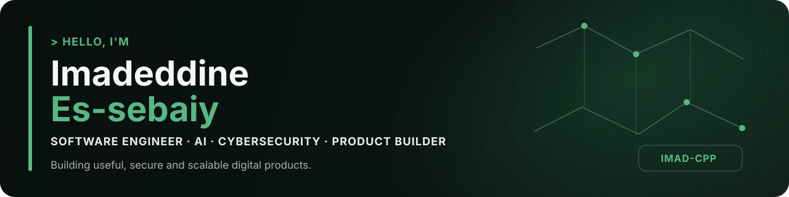
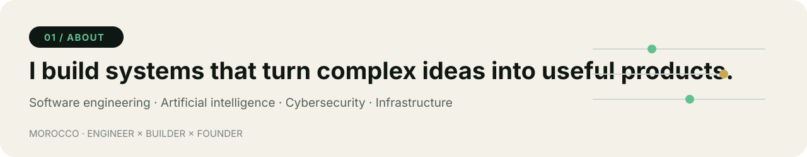
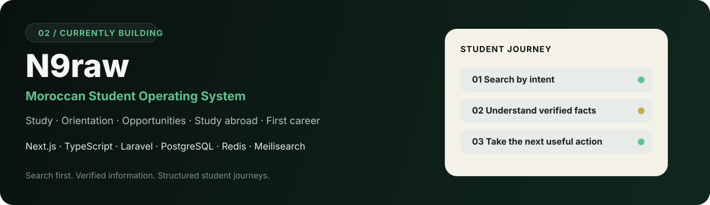
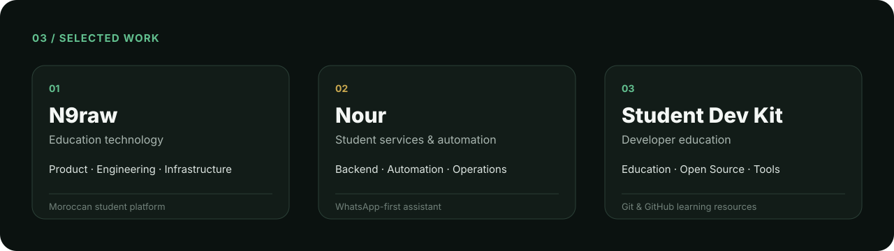
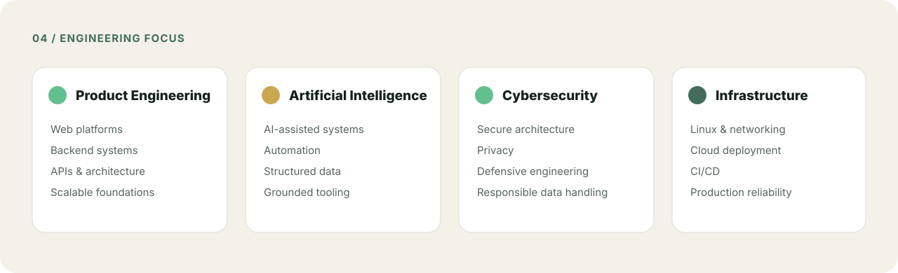
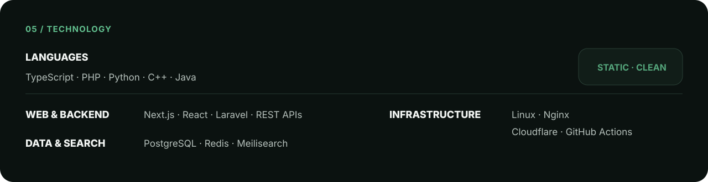
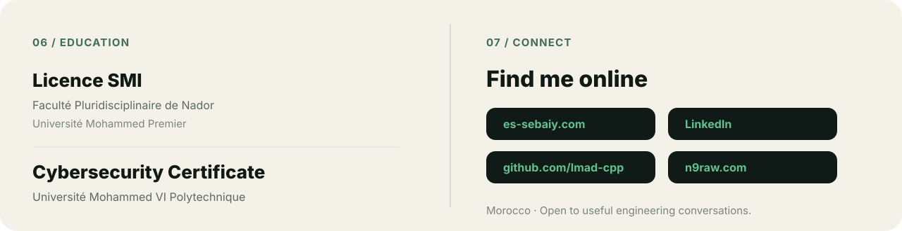

  

  

  <strong>Software Engineer · AI · Cybersecurity · Product Builder</strong> 
  Morocco 🇲🇦

  <a href="https://es-sebaiy.com">Website</a>
  &nbsp;·&nbsp;
  <a href="https://linkedin.com/in/imadeddine-es-sebaiy">LinkedIn</a>
  &nbsp;·&nbsp;
  <a href="https://n9raw.com">N9raw</a>
  &nbsp;·&nbsp;
  <a href="https://github.com/Imad-cpp">GitHub</a>

 

  

I build useful, secure and scalable digital products. I enjoy turning complex ideas into structured systems that solve real problems across product engineering, backend development, AI, cybersecurity and infrastructure.

 

  

**N9raw** is designed to help Moroccan students study, make informed education choices, discover opportunities and move from education toward their first career.

  <a href="https://n9raw.com"><strong>Visit N9raw →</strong></a>

 

  

  <strong>N9raw</strong> · Product / Engineering / Infrastructure
  &nbsp;&nbsp;|&nbsp;&nbsp;
  <strong>Nour</strong> · Backend / Automation / Operations
  &nbsp;&nbsp;|&nbsp;&nbsp;
  <strong>Student Dev Kit</strong> · Education / Open Source

 

  

 

  

 

  

  <a href="https://es-sebaiy.com">es-sebaiy.com</a>
  &nbsp;·&nbsp;
  <a href="https://linkedin.com/in/imadeddine-es-sebaiy">LinkedIn</a>
  &nbsp;·&nbsp;
  <a href="https://github.com/Imad-cpp">@Imad-cpp</a>
  &nbsp;·&nbsp;
  <a href="https://n9raw.com">n9raw.com</a>

---

  <strong>Build useful systems. Keep them understandable. Make them last.</strong>

