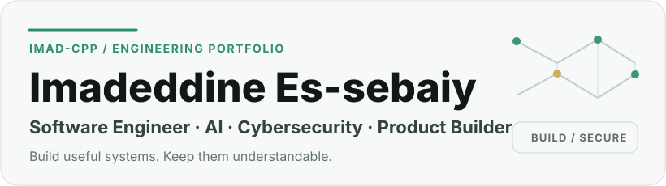
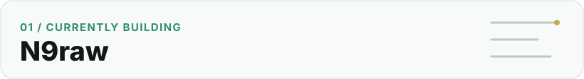
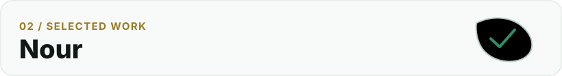
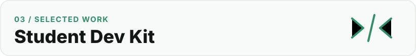

  <picture>
    <source media="(prefers-color-scheme: dark)" srcset="./assets/hero-dark.svg">
    <source media="(prefers-color-scheme: light)" srcset="./assets/hero-light.svg">
    
  </picture>

  <a href="https://es-sebaiy.com">Website</a> ·
  <a href="https://www.linkedin.com/in/imadeddine-es-sebaiy">LinkedIn</a> ·
  <a href="https://github.com/Imad-cpp?tab=repositories">Repositories</a> ·
  <a href="https://n9raw.com">N9raw</a>

## About

I build useful, secure and scalable digital products, with a focus on **software engineering, intelligent systems, cybersecurity and reliable infrastructure**.

I enjoy turning complex ideas into structured systems that solve real problems. I care about clear architecture, useful products, privacy, reliability and systems that can grow without becoming difficult to understand.

Based in **Morocco**.

## Currently building

  <picture>
    <source media="(prefers-color-scheme: dark)" srcset="./assets/project-n9raw-dark.svg">
    <source media="(prefers-color-scheme: light)" srcset="./assets/project-n9raw-light.svg">
    
  </picture>

### N9raw — Moroccan Student Operating System

N9raw is being built to help Moroccan students **study, make informed education choices, discover opportunities and move from education toward their first career**.

`Next.js` · `React` · `TypeScript` · `Laravel` · `PostgreSQL` · `Redis` · `Meilisearch` · `Cloudflare`

**Role:** Founder · Product · Engineering · Infrastructure

[Explore N9raw →](https://n9raw.com)

## Selected work

**N9raw** — flagship education product featured above.

  <picture>
    <source media="(prefers-color-scheme: dark)" srcset="./assets/project-nour-dark.svg">
    <source media="(prefers-color-scheme: light)" srcset="./assets/project-nour-light.svg">
    
  </picture>

### Nour

A WhatsApp-first student assistant and service platform for FPN students, built around practical academic services and automation.

**Focus:** Backend · Automation · Integrations · Operations

  <picture>
    <source media="(prefers-color-scheme: dark)" srcset="./assets/project-devkit-dark.svg">
    <source media="(prefers-color-scheme: light)" srcset="./assets/project-devkit-light.svg">
    
  </picture>

### N9raw Student Developer Kit

A hands-on learning project for students practising Git, GitHub and software development through structured material.

**Focus:** Developer Education · Git · GitHub · Software Development

The repository is still being prepared before public presentation.

## Engineering focus

**01 · Product engineering**  
Web platforms, backend systems, APIs, product architecture and scalable foundations.

**02 · Artificial intelligence**  
AI-assisted systems, automation, structured data and practical tools grounded in real product needs.

**03 · Cybersecurity**  
Secure architecture, privacy, defensive engineering, access control and responsible data handling.

**04 · Infrastructure**  
Linux, deployment, networking, CI/CD, cloud operations and production reliability.

## Technology

**Languages**  
`TypeScript` · `PHP` · `Python` · `C++` · `Java`

**Frontend**  
`Next.js` · `React`

**Backend**  
`Laravel` · `REST APIs`

**Data & Search**  
`PostgreSQL` · `Redis` · `Meilisearch`

**Infrastructure & Tooling**  
`Linux` · `Nginx` · `Cloudflare` · `GitHub Actions` · `Git`

## Education

### Licence SMI
Faculté Pluridisciplinaire de Nador · Université Mohammed Premier

### Cybersecurity Certificate
Université Mohammed VI Polytechnique

## Connect

- [Personal website — es-sebaiy.com](https://es-sebaiy.com)
- [LinkedIn — Imadeddine Es-sebaiy](https://www.linkedin.com/in/imadeddine-es-sebaiy)
- [GitHub repositories — @Imad-cpp](https://github.com/Imad-cpp?tab=repositories)
- [N9raw — n9raw.com](https://n9raw.com)

---

<strong>Build useful systems. Keep them understandable. Make them last.</strong>

