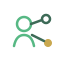

  <picture>
    <source media="(prefers-color-scheme: dark) and (max-width: 600px)" srcset="./assets/hero/hero-mobile-dark.svg">
    <source media="(prefers-color-scheme: light) and (max-width: 600px)" srcset="./assets/hero/hero-mobile-light.svg">
    <source media="(prefers-color-scheme: dark)" srcset="./assets/hero/hero-desktop-dark.svg">
    <source media="(prefers-color-scheme: light)" srcset="./assets/hero/hero-desktop-light.svg">
    
  </picture>

  <a href="https://es-sebaiy.com">Website</a> ·
  <a href="https://www.linkedin.com/in/imadeddine-es-sebaiy">LinkedIn</a> ·
  <a href="https://n9raw.com">N9raw</a> ·
  <a href="https://github.com/Imad-cpp?tab=repositories">Repositories</a>

  <a href="./profile/about.md">About</a> ·
  <a href="./profile/work.md">Work</a> ·
  <a href="./profile/education.md">Education</a> ·
  <a href="./profile/certifications.md">Certifications</a> ·
  <a href="./profile/github-engineering.md">GitHub Engineering</a>

## I build systems around real problems

I am a Moroccan founder and software builder working across **product engineering, backend systems, cybersecurity and infrastructure**.

My strongest work sits between product and engineering: defining the problem, structuring the system, building the software, connecting services, operating it reliably and documenting the decisions that make future changes safer.

[About me →](./profile/about.md) · [Detailed work →](./profile/work.md)

## Signal areas

 **Product engineering** — product structure, system design and implementation boundaries.

 **Backend systems** — APIs, integrations, queues, application logic and administration.

 **Cybersecurity** — access control, privacy boundaries, secrets and defensive engineering.

 **Infrastructure** — Linux, Nginx, deployment, diagnostics and operational reliability.

 **GitHub practice** — coherent commits, CI, ADRs, changelogs and traceable engineering history.

 **Verified learning** — real programs, sourced credentials and applied technical learning.

## Current focus — N9raw

  <picture>
    <source media="(prefers-color-scheme: dark)" srcset="./assets/projects/case-n9raw-dark.svg">
    <source media="(prefers-color-scheme: light)" srcset="./assets/projects/case-n9raw-light.svg">
    
  </picture>

**N9raw** is the main product I am building: a trusted Moroccan Student Operating System designed to help students study, orient themselves, discover opportunities and move toward further education and first employment.

**Role:** Founder · Product · Engineering · Infrastructure  
**Architecture:** `Next.js` · `React` · `TypeScript` · `Laravel` · `PostgreSQL` · `Redis` · `Meilisearch` · `Cloudflare`

[Explore N9raw](https://n9raw.com) · [Read the N9raw case study →](./profile/case-studies/n9raw.md)

## Selected systems

###  Nour FPN

**WhatsApp-first student assistant · Backend · Integrations · Operations**

Laravel, queued message processing, WhatsApp Cloud API integration, academic-service flows, scoped administration and Linux production operations.

[Case study →](./profile/case-studies/nour-fpn.md)

###  N9raw Student Dev Kit

**Developer education · Git · GitHub · Bilingual documentation**

Practical French/Arabic learning material for students building Git/GitHub workflow, project documentation and privacy-safe engineering habits.

[Case study →](./profile/case-studies/n9raw-student-dev-kit.md)

###  Nexar

**Founder · Product experience · Operations**

A gaming-hall founder project in Morocco. I keep product/founder evidence separate from software claims until technical implementation is actually ready to support them.

[Case study →](./profile/case-studies/nexar.md)

## How I engineer

 **01 · Product → system** — turn broad ideas into scope, flows, architecture and implementation boundaries.

 **02 · Backend → integration** — Laravel, APIs, webhooks, queues, stateful workflows and administration.

 **03 · Security → reliability** — permissions, privacy, secrets, deployment controls and rollback thinking.

 **04 · GitHub → engineering record** — coherent commits, CI, ADRs, source-of-truth documentation and traceable project history.

[See detailed engineering capabilities →](./profile/work.md) · [See my GitHub workflow →](./profile/github-engineering.md)

## Education & cybersecurity

###  Academic foundation

**Informatique et Intelligence Artificielle**  
Faculté Pluridisciplinaire de Nador · Université Mohammed Premier · **Completed 2026**

###  Cybersecurity track

**Applied Computer Science Program — Cybersecurity**  
UM6P / Higher Education Without Borders — ACSP · **2025–2026**

**Learning milestones:** `Computer Networks` · `Linux Fundamentals` · `Programming I` · `ALX Professional Foundations`

[Education →](./profile/education.md) · [Certifications →](./profile/certifications.md)

## Technology I use

 **Languages**  
`TypeScript` · `PHP` · `Python` · `C++` · `Java`

 **Web & Backend**  
`Next.js` · `React` · `Laravel`

 **Data & Search**  
`PostgreSQL` · `Redis` · `Meilisearch`

 **Infrastructure & Tooling**  
`Linux` · `Nginx` · `Cloudflare` · `GitHub Actions` · `Git`

## Connect

 **Personal website** — [es-sebaiy.com](https://es-sebaiy.com)

 **Professional network** — [LinkedIn](https://www.linkedin.com/in/imadeddine-es-sebaiy)

 **Repositories** — [github.com/Imad-cpp](https://github.com/Imad-cpp?tab=repositories)

 **Current product** — [N9raw](https://n9raw.com)

---

<strong>Build useful systems. Keep them understandable. Make them last.</strong>

