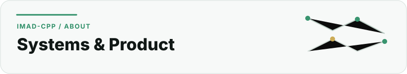

  <picture>
    <source media="(prefers-color-scheme: dark)" srcset="../assets/sections/about-dark.svg">
    <source media="(prefers-color-scheme: light)" srcset="../assets/sections/about-light.svg">
    
  </picture>

# About

[← Back to profile](../README.md) · [Work](work.md) · [Education](education.md) · [Certifications](certifications.md) · [GitHub Engineering](github-engineering.md)

## Imadeddine Es-sebaiy

I am a Moroccan software builder and student founder working across **product engineering, cybersecurity, infrastructure and applied technology**.

My work is usually at the point where an idea has to become a real system: defining the problem, structuring the product, choosing an architecture, building the software, connecting external services, documenting decisions and keeping the result understandable enough to maintain.

I am the founder of **N9raw**, an education technology initiative for Moroccan students, and **Nexar**, a gaming-hall project focused on building a modern gaming experience in Morocco. I also built and operate **Nour FPN**, N9raw's WhatsApp-first student-assistance implementation for students at the Faculté Pluridisciplinaire de Nador.

## What I care about

###  Useful products

I prefer software that removes a concrete problem over technology added only because it is fashionable. That means starting from the user, the workflow and the constraints before choosing tools.

###  Understandable systems

Architecture should make future work easier. I value clear module boundaries, explicit decisions, useful documentation, predictable data flows and small changes that can be reviewed safely.

###  Security and privacy

Security is part of product engineering, not a final checklist. I pay particular attention to access control, secrets, data minimisation, safe infrastructure, auditability and responsible handling of student data.

###  Reliable delivery

I enjoy the operational side of engineering as much as implementation: Linux, Nginx, deployment, queues, CI, rollback planning, observability and keeping production changes controlled.

###  Learning by building

My academic path combines computer science and artificial intelligence with an Applied Computer Science Program focused on cybersecurity. I use projects as a way to turn theory into practical engineering decisions.

## Current direction

My main long-term product work is **N9raw**, which I am building as a trusted Moroccan student platform from education and orientation through opportunities and the first steps toward employment.

At the same time, I continue developing my foundations in cybersecurity, software architecture and infrastructure while documenting reusable lessons for students through the **N9raw Student Dev Kit**.

## How I describe my work

I do not separate product, software and operations when a project requires all three. My strongest work tends to combine:

 **Product & systems** — product and system design; backend and API development.

 **Integration & automation** — automation and external integrations.

 **Operations & security** — infrastructure and deployment; security-minded architecture.

 **Engineering practice** — Git/GitHub workflow and engineering documentation.

 **Applied learning** — technical learning translated into practical systems.

## Based in Morocco

I am building from Morocco, with a particular interest in products that solve local problems well while being engineered with standards that can scale beyond a single institution or use case.

---

**Next:** [See what I build and how I work →](work.md)
