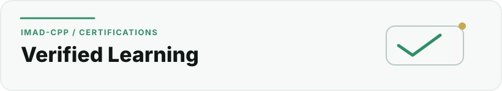

  <picture>
    <source media="(prefers-color-scheme: dark)" srcset="../assets/sections/certifications-dark.svg">
    <source media="(prefers-color-scheme: light)" srcset="../assets/sections/certifications-light.svg">
    
  </picture>

# Certifications

[← Back to profile](../README.md) · [About](about.md) · [Work](work.md) · [Education](education.md) · [GitHub Engineering](github-engineering.md)

This page records completed learning milestones that are currently visible on my public professional profile. It is intentionally a **credential ledger**, not a badge wall.

## Verified learning timeline

 **2025 · Professional foundations** — ALX Professional Foundations Certificate  
 **2025 · Programming foundation** — Programming I · ACSP  
 **2025–2026 · Linux foundation** — Linux Fundamentals · ACSP  
 **2026 · Networking foundation** — Computer Networks · ACSP

##  Computer Networks

**Issuer:** ACSP  
**Period listed:** March 2026 – April 2026

This milestone supports the networking foundation behind my infrastructure and cybersecurity work: understanding how systems communicate, how network services are structured and why network boundaries matter when designing secure applications.

**Practical signal:** networking fundamentals · service exposure · infrastructure reasoning · security-aware deployment

##  Linux Fundamentals

**Issuer:** ACSP  
**Period listed:** December 2025 – February 2026

Linux is directly relevant to the way I deploy and operate software. My project work includes Linux-based environments, Nginx, application processes, queues, permissions, logs and operational troubleshooting.

**Practical signal:** Linux administration · processes · permissions · filesystems · server operations · deployment foundations

##  Programming I

**Issuer:** ACSP  
**Period listed:** October 2025 – December 2025

This credential forms part of the common programming foundation in my Applied Computer Science Program path.

**Practical signal:** problem solving · programming logic · structured code · core software-development concepts

##  ALX Professional Foundations Certificate

**Issuer:** ALX Academy  
**Period listed:** March 2025 – June 2025  
**Credential ID:** `SGx25eZM3C`

Professional Foundations complements technical learning with the skills needed to work effectively around real projects: communication, collaboration, self-management, problem framing and professional development.

The official ALX material for Professional Foundations describes a development path around self-awareness, teamwork, entrepreneurship, career direction and transferable professional skills.

**Practical signal:** communication · collaboration · self-management · problem framing · professional development

## How I use certifications

I do not treat a certificate as proof that a skill is finished. I use credentials as checkpoints in a longer learning path and then look for ways to apply the underlying concepts in real systems.

 **Networking → security decisions** — networking knowledge informs infrastructure and security decisions.

 **Linux → operations** — Linux learning is reinforced through real server administration.

 **Programming → software projects** — programming foundations are exercised through software projects.

 **Professional foundations → project ownership** — professional-development learning supports product communication, documentation and project ownership.

## Verification

Credential names and periods above are based on my current public LinkedIn profile and were reviewed for this profile project on **12 August 2026**.

- [LinkedIn — Imadeddine Es-sebaiy](https://www.linkedin.com/in/imadeddine-es-sebaiy)
- [ACSP](https://www.acsp.ma/)
- [Profile source register](../docs/CONTENT_SOURCES.md)

---

**Next:** [See how I work with Git and GitHub →](github-engineering.md)
