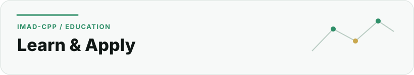

  <picture>
    <source media="(prefers-color-scheme: dark)" srcset="../assets/sections/education-dark.svg">
    <source media="(prefers-color-scheme: light)" srcset="../assets/sections/education-light.svg">
    
  </picture>

# Education

[← Back to profile](../README.md) · [About](about.md) · [Work](work.md) · [Certifications](certifications.md) · [GitHub Engineering](github-engineering.md)

This page separates **my personal academic history** from **official program descriptions** so that the profile does not turn institutional marketing into personal claims.

## Education path

 **Degree · Completed 2026** — Informatique et Intelligence Artificielle · Faculté Pluridisciplinaire de Nador · Université Mohammed Premier

 **Cybersecurity program · 2025–2026** — Applied Computer Science Program · UM6P / Higher Education Without Borders — ACSP

##  Informatique et Intelligence Artificielle

**Faculté Pluridisciplinaire de Nador — Université Mohammed Premier**  
**Completed: 2026**

I completed my degree in **Informatique et Intelligence Artificielle** at the Faculté Pluridisciplinaire de Nador (FPN), part of Université Mohammed Premier.

The program sits at the intersection of computer science and artificial intelligence and gave me an academic base that supports the work I now do in software, product engineering and cybersecurity.

### Areas that connect most strongly to my current work

- programming and software development;
- algorithms and data structures;
- databases and information systems;
- networking and security foundations;
- artificial intelligence and machine learning; and
- building technical projects from theory into implementation.

### Official institution reference

FPN's current official diploma catalogue lists **Informatique et Intelligence Artificielle** among its Licence Fondamentale programs.

- [Faculté Pluridisciplinaire de Nador — Diplômes](https://fpn.ump.ma/index.php/fr/diplomes)

##  Applied Computer Science Program — Cybersecurity

**UM6P / Higher Education Without Borders — ACSP**  
**2025–2026**  
**Track: Cybersecurity**

Alongside my university path, I joined the **Applied Computer Science Program (ACSP)** with a cybersecurity specialization.

My public academic record and learning milestones include coursework in programming, Linux and computer networks, with the broader cybersecurity track oriented toward practical security skills.

### Program context

ACSP describes its model as a combination of a strong computer-science common core, specialized learning paths, live instructor support, hands-on labs and applied projects. Cybersecurity is one of its current specialization tracks.

- [ACSP — official program website](https://www.acsp.ma/)
- [Higher Education Without Borders](https://www.hewb.org/)

### Why it matters to my engineering work

The cybersecurity path reinforces the way I already like to build systems: permissions first, private data handled carefully, infrastructure treated as part of the threat surface and operational decisions documented rather than left implicit.

## Learning approach

My education is most useful to me when it becomes something I can test in a real system. That is why I combine formal study with active product work:

 **Software → architecture** — software concepts become application architecture.

 **Networking → infrastructure** — networking becomes deployment and infrastructure reasoning.

 **Security → product decisions** — security concepts become access-control and privacy decisions.

 **AI → use cases** — AI concepts become structured, use-case-driven product thinking.

 **Git/GitHub → workflow** — Git/GitHub becomes an engineering workflow rather than only version control.

## Sources and verification

Personal chronology and credential information is cross-checked against my current public LinkedIn profile. Institution and program descriptions are taken from the official FPN and ACSP/HEWB sources listed above.

- [LinkedIn — Imadeddine Es-sebaiy](https://www.linkedin.com/in/imadeddine-es-sebaiy)
- [Profile source register](../docs/CONTENT_SOURCES.md)

---

**Next:** [See certifications and completed learning milestones →](certifications.md)
