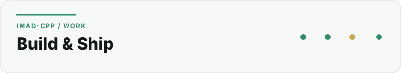
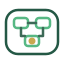

  <picture>
    <source media="(prefers-color-scheme: dark)" srcset="../assets/sections/work-dark.svg">
    <source media="(prefers-color-scheme: light)" srcset="../assets/sections/work-light.svg">
    
  </picture>

# Work

[← Back to profile](../README.md) · [About](about.md) · [Education](education.md) · [Certifications](certifications.md) · [GitHub Engineering](github-engineering.md)

I work across the full path from an idea to a maintained digital product. The sections below focus on **capabilities backed by real project work**, not a generic list of technologies.

## Capability map

 **Product engineering** — scope, user journeys, data models, system boundaries and implementation planning.

 **Backend systems** — Laravel applications, APIs, webhooks, queues, stateful flows and administration.

 **Security-minded engineering** — permissions, secrets, privacy boundaries, auditability and safer system design.

 **Infrastructure & delivery** — Linux, Nginx, Docker, deployment, CI, diagnostics and rollback thinking.

 **Architecture & engineering record** — source-of-truth documentation, ADRs, quality gates and traceable change history.

 **Developer education** — practical Git/GitHub learning material built around verifiable tasks.

##  Product and software engineering

I turn broad product ideas into structured scopes, user journeys, data models, system boundaries and implementation plans.

**Evidence**  
**N9raw** — product direction, information architecture, technical architecture and implementation governance for a Moroccan student platform.  
**Nour FPN** — student-facing services, WhatsApp interaction flows and a Laravel administration surface.

**This work includes**

- defining product scope and non-scope;
- translating student problems into usable flows;
- designing modular application boundaries;
- structuring implementation phases;
- documenting decisions before large technical changes; and
- keeping architecture aligned with the product instead of treating it as a separate exercise.

##  Backend systems, APIs and integrations

A large part of my practical work is backend-oriented.

With **Nour FPN**, I have worked on a Laravel application connected to the WhatsApp Cloud API, background jobs and FPN-related academic services. The system handles student interactions, academic-service requests, administration and operational workflows.

With **Secure File Gateway**, I built a public Laravel API around a deliberately narrow security boundary: authenticated file ingestion, private quarantine, server-side MIME validation, SHA-256 metadata, owner-scoped duplicate handling, Redis-backed malware scanning, controlled signed delivery and deletion. The project reached a public [`v1.0.0`](https://github.com/Imad-cpp/secure-file-gateway/releases/tag/v1.0.0) backed by inspectable CI and release evidence.

**Areas I have worked with**

- Laravel application architecture;
- REST APIs, OpenAPI and webhook integrations;
- queues and asynchronous processing;
- session/state-machine style conversational flows;
- validation and object-level access control;
- private object-storage boundaries;
- academic catalogue mapping;
- administration workflows; and
- error handling, failure compensation and operational controls.

##  Infrastructure and delivery

I am comfortable working below the application layer when a project needs it.

**Practical infrastructure work**

- Linux server administration;
- Nginx and PHP-FPM deployments;
- Docker Compose integration environments;
- process supervision and queues;
- environment and secret handling;
- PostgreSQL, Redis and S3-compatible object-storage integration;
- Cloudflare-oriented access and edge planning;
- GitHub Actions and CI checks;
- deployment and rollback procedures;
- domain/subdomain routing; and
- production diagnostics.

Secure File Gateway adds a public example of integration evidence: its CI boots Laravel with PostgreSQL, Redis, MinIO-compatible storage and ClamAV, applies migrations, verifies readiness, starts the scan worker and runs clean/EICAR application paths before the release audit can pass.

I prefer infrastructure that is documented and reversible rather than a collection of commands that only one person understands.

##  Security-minded engineering

My cybersecurity studies directly influence how I approach software projects.

**I pay attention to**

- server-side permissions and object-level authorization;
- authentication and privileged access;
- secret management;
- private file storage and delivery;
- data minimisation;
- safe logging and analytics;
- rate limiting;
- audit trails;
- staging isolation;
- fail-closed dependency behavior; and
- threat-aware system design.

Secure File Gateway makes several of these concerns publicly inspectable: uploads are untrusted by default, client MIME is not trusted, quarantine is private, storage keys are server-generated, scanner errors fail closed, duplicate checks are owner-scoped to avoid a cross-user presence oracle, and signed delivery re-checks lifecycle state.

For student products, this matters even more because educational systems can involve minors, identifiers and sensitive academic information.

##  Technical architecture and documentation

I treat architecture and documentation as part of engineering work.

For N9raw, the project workflow includes source-of-truth documentation, decision logs, architecture decision records, implementation phases, quality gates, progress records and change history.

For Secure File Gateway, architecture, security model, API map, engineering decisions, Definition of Done, OpenAPI contract, evidence ledger and release audit live with the implementation and are checked as part of the engineering workflow.

The objective is not documentation for its own sake. The objective is to make important decisions **reviewable, traceable and harder to accidentally undo**.

##  Developer education

Through the **N9raw Student Dev Kit**, I am also working on practical material for students learning Git, GitHub and software-development workflow.

The kit is designed around tasks that produce a verifiable result, such as:

- creating a first local Git repository;
- connecting a repository to GitHub;
- opening a first pull request;
- recovering from common Git mistakes without losing work; and
- documenting university projects clearly in French and Arabic.

## Technology I use

 **Languages**  
`TypeScript` · `PHP` · `Python` · `C++` · `Java`

 **Web & backend**  
`Next.js` · `React` · `Laravel` · `REST APIs` · `OpenAPI`

 **Data & search**  
`PostgreSQL` · `Redis` · `Meilisearch`

 **Infrastructure & tooling**  
`Linux` · `Nginx` · `Docker` · `Cloudflare` · `GitHub Actions` · `Git`

## Project case studies

 [N9raw →](case-studies/n9raw.md)  
 [Secure File Gateway →](case-studies/secure-file-gateway.md)  
 [Nour FPN →](case-studies/nour-fpn.md)  
 [N9raw Student Dev Kit →](case-studies/n9raw-student-dev-kit.md)  
 [Nexar →](case-studies/nexar.md)

---

**Next:** [See my GitHub engineering workflow →](github-engineering.md)
